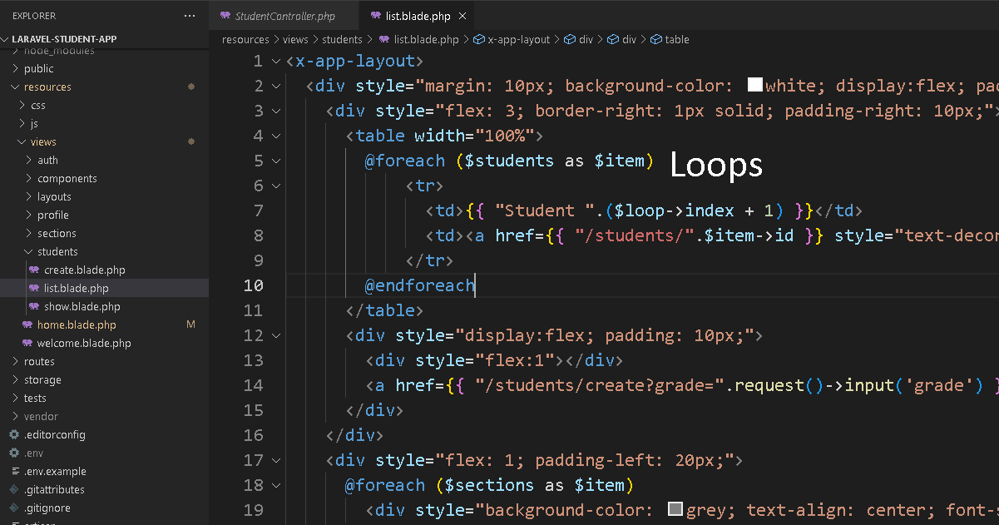

## Tasks

It is a student database management system. I want the front end to be in HTML and CSS, and the back end could be done using PHPMyAdmin, or any other database MySQL-supporting software. I have made basic "graphic visualisation" diagrams from the website attached below. Essentially, the project should consist of at least 7 of the following:

1. Arrays
2. User-defined objects
3. Objects as data records
4. Simple selection (if–else)
5. Complex selection (nested if, if with multiple conditions or switch)
6. Loops
7. Nested loops
8. User-defined methods
9. User-defined methods with parameters (the parameters have to be useful and used within the method body)
10. User-defined methods with appropriate return values (primitives or objects)
11. Sorting
12. Searching
13. File i/o
14. Use of additional libraries (such as utilities and graphical libraries not included in appendix 2 Java Examination Tool Subsets)
15. Use of sentinels or flags

The project and the visualisation can be modified, as long as they still meet the criteria, and similar. Keep it simple. I would also need screenshots of the code (only the parts that have the above criteria), around 5 should be good.

## Interfaces

## Presentation

